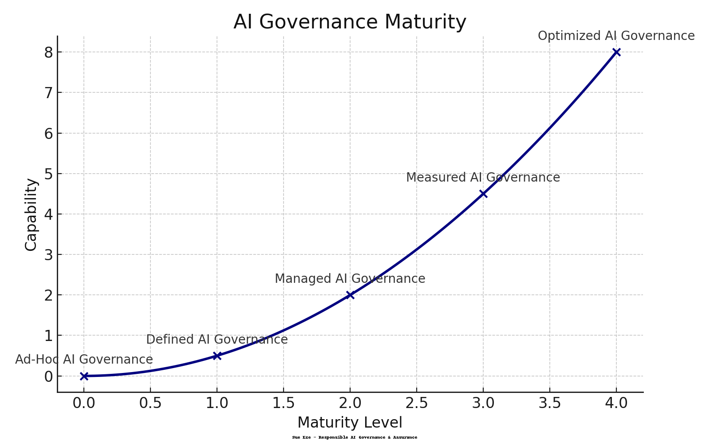

# **Automation Must Serve Humans  Not Harm Them**
### Responsible AI Incident Response & Governance Portfolio  
**By Sue Eze  Responsible AI Risk & Compliance Consultant** 
I specialise in assessing, governing and mitigating risks in AI-enabled decision systems — ensuring transparency, accountability, and human oversight are present where automated decisions impact people, rights, access to services, and life outcomes. My work focuses on preventing harm, supporting compliance with the EU AI Act and GDPR Article 22, and ensuring that automation always serves and protects the public.

I protect people and public trust by ensuring AI systems are safe before deployment.

---

###  Mission

Mission
Automated decisions must never violate human rights...
---

##  AI Governance Maturity Model

AI Governance matures as oversight, capability, and accountability strengthen.  
This model illustrates how organisations progress from **uncontrolled automation** to **auditable, transparent and human-centred AI decision-making.**

### Maturity Levels

| Stage | Description |
|------|-------------|
| **Ad-Hoc AI Governance** | Models deployed without structured oversight, documentation, or risk assessment. |
| **Defined AI Governance** | Governance principles exist, but adoption varies across teams and projects. |
| **Managed AI Governance** | Risk assessment, approval, documentation, and human oversight are operationalised. |
| **Measured AI Governance** | Bias, drift, robustness, privacy and explainability metrics are continuously monitored. |
| **Optimized AI Governance** | Governance is proactive, culture-aligned, regulation-ready, and continuously improved. |

---

Policy Summary (Table of Contents)
--------------------------------
Case Studies: Automation Harm in the Real World
--------------------------------

 Case Study: NI Child Benefit Removal Due to Travel Pattern Bias
   • What failed
   • Harm caused to families
   • Which policy controls would prevent it
   • Status:  Published |  View Details

...
##  Case Studies: When Automation Harms People

I research and document real-world failures where automated systems
misinterpret human behaviour, to prevent future harm.

---

### **Case Study 1 — NI Child Benefit Suspension Due to Travel Blind Spots**

Families in Northern Ireland who legally travelled via Dublin airport
were automatically classified as "living abroad" and had their Child Benefit
payments **suddenly stopped**.

This resulted in:
- wrongful loss of essential income
- emotional harm and stress to parents
- deprivation risks for children
- delayed assistance due to lack of explanation

**Governance Failures:**
-  No blind-spot scenario testing  
-  No Human-in-the-Loop before suspension of essential benefits  
-  No monitoring of regional false-positive spikes  
-  No named owner for harm escalation  

**Policy Controls That Prevent This:**
 Population Scope Validation  
 Protected Group Safeguards  
 Mandatory HITL for essential service suspensions  
 Continuous Trust Monitoring  
 Reason & Appeal Rights under GDPR Art. 22  

 Full analysis and governance solution inside repository  
 Full Responsible AI Governance Policy available under NDA  

## Responsible AI Governance Policy 

 Professional ISO/IEC 42001 Aligned Governance Structure

> Full policy document is confidential — Table of Contents shared for demonstration of structure and scope.

### Table of Contents

1. Introduction
   1.1 Purpose and Scope
   1.2 Document Ownership & Maintenance
   1.3 Compliance & Enforcement
2. Responsible AI Governance Controls
   2.1 Context & Scope Validation
   2.2 Scenario & Edge-Case Testing
   2.3 Data Risk Assessments
   2.4 Human Oversight & Escalation
   2.5 Public Trust Monitoring
   2.6 Standards & Legal Alignment
   2.7 Accountability & Audit
   2.8 Continuous Monitoring
3. Standards Mapping
   3.1 NIST AI RMF
   3.2 ISO/IEC 42001
   3.3 GDPR
   3.4 ISO 27001/27701
4. Appendices
   4.1 Key Terms
   4.2 Roles & Responsibilities
   4.3 Exception Handling
   4.4 Revision History

Full policy available under NDA for professional review
--------------------------------

###  Case Studies
Where Governance Failed in the Real World 

| Case | Description | Status | Link |
|------|-------------|--------|------|
| 01 | NI Airport Benefit Suspension  Governance Failure & Rights Harm |  Publishing Soon |  case01_ni_airport_harm |
| 02 | DWP False Fraud Flags  High False Positive Harm |  In Progress | Coming Soon |
| 03 | Facial Recognition Wrong Arrests  Identity Rights Violation |  In Progress | Coming Soon |

---

###  My Governance Doctrine **ROAR**

**R  Risk Prevention**  
Unknown risk must never be automated into harm.

**O   Oversight by Design**  
High-impact decisions require **human review**.

**A   Accountability Enforcement**  
Every automated outcome must have **a responsible owner**.

**R   Rights Protection**  
Human dignity is the highest KPI.

---

###  Public Values

 Prevent automated injustices  
 Protect vulnerable communities  
 Ensure fairness & accountability  
 Build public trust in AI  

---

**More cases releasing soon.**  
**Automation must serve humans  not harm them.**
### Governance Lessons

• When data is incomplete, decisions must not progress automatically  
• Automated assumptions must be verified by accountable humans  
• Financial rights require immediate oversight escalation  

### Controls That Could Have Prevented Harm

| Risk | Control | Governance Owner |
|------|---------|-----------------|
| Missing re-entry data | Human-review queue before suspension | DWP / HMRC Caseworkers |
| Assumption of departure | Context validation before action | Data Governance Lead |
| Unverified sanctions | Rights impact assessment before benefits changes | Compliance Team |

---

###  Contact  
 *(Add your LinkedIn link here when you're ready)*  
